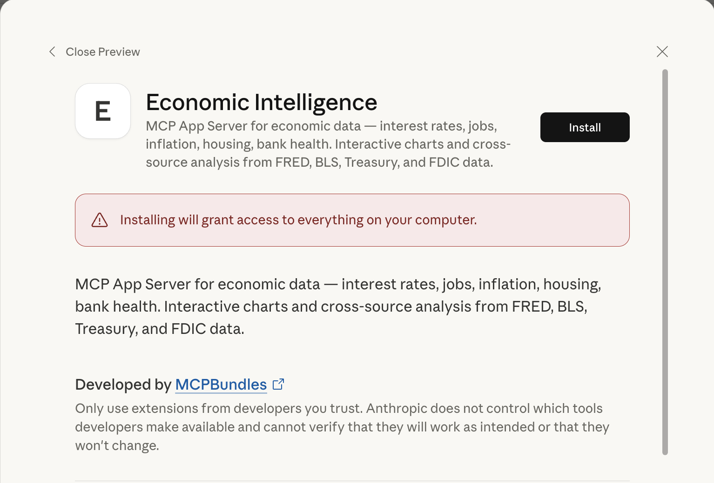
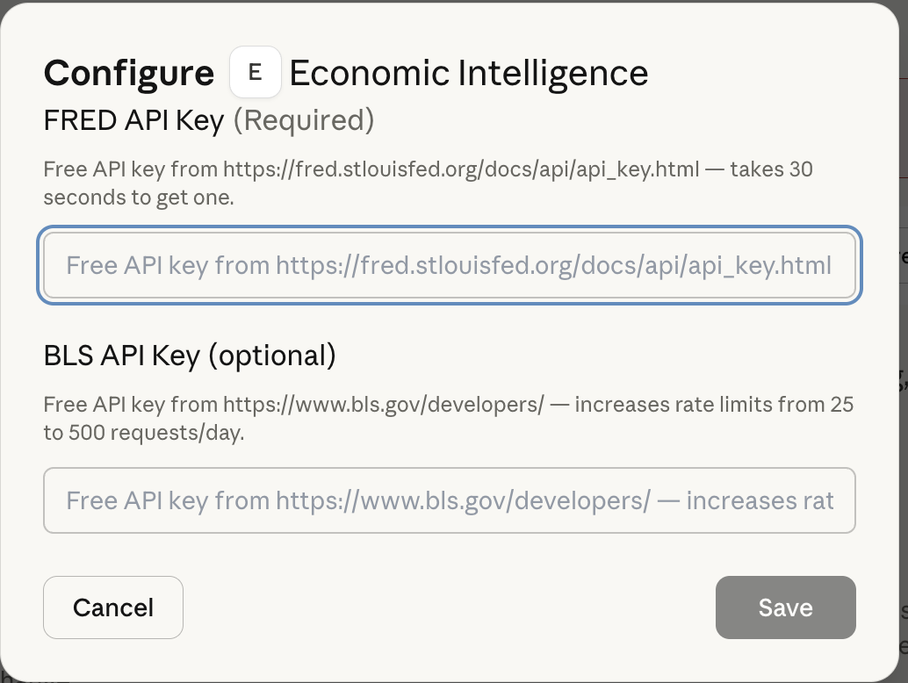
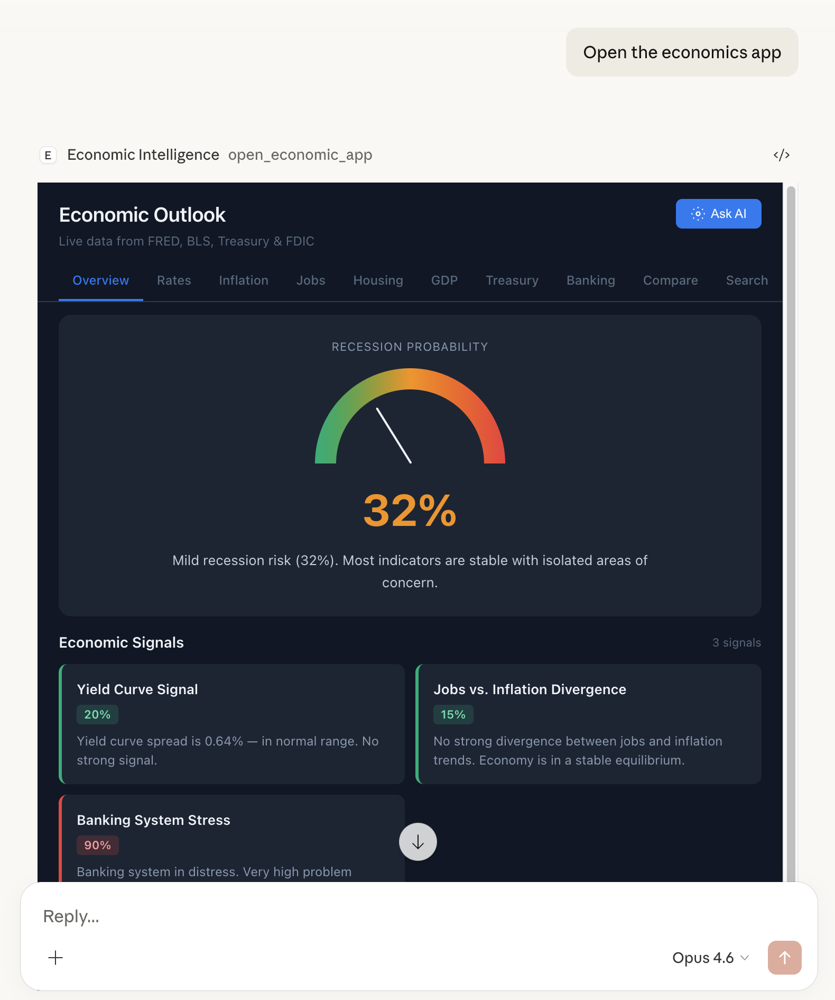

# Economic Intelligence MCP

<p align="center">
  <strong>Ask your AI about the economy — interest rates, jobs, inflation, housing, bank health.</strong><br/>
  Interactive app with cross-source analysis from FRED, BLS, Treasury, and FDIC data.
</p>

<p align="center">
  <a href="https://github.com/thinkchainai/economic-intelligence-mcp/releases/latest"></a>
  <a href="https://github.com/thinkchainai/economic-intelligence-mcp"></a>
  <a href="LICENSE"></a>
</p>

---

## Quick Start

### 1. Clone the repo

```bash
git clone https://github.com/thinkchainai/economic-intelligence-mcp.git
cd economic-intelligence-mcp
```

### 2. Double-click the `.mcpb` file

Open `economic-intelligence-mcp.mcpb` — Claude Desktop will prompt you to install it.



### 3. Add your FRED API key

**Get a free key** (30 seconds): https://fred.stlouisfed.org/docs/api/api_key.html

Claude Desktop will ask for it during setup:



### 4. Configure permissions

The server has 1 interactive tool (`open_economic_app`) and 12 read-only data tools:


### 5. Enable the connector


### 6. Open the economics app

Just type "Open the economics app" and Claude will launch the interactive dashboard:



The app has tabbed navigation for rates, inflation, jobs, housing, GDP, treasury, banking, comparison, and search — all with live data and interactive charts.

**Other things to try:**

> "Show me interest rates over the last 5 years"
>
> "Compare unemployment rate with inflation"
>
> "Any economic alerts right now?"
>
> "How has the yield curve signal changed over the last 6 months?"

---

## 13 Tools

### Interactive App (1 tool)

| Tool | What it does |
|---|---|
| `open_economic_app` | Opens the interactive dashboard — charts, recession gauge, signals, data explorer |

### Live Data (9 tools)

| Tool | What it does |
|---|---|
| `econ_interest_rates` | Fed funds, 10Y/30Y treasury, mortgage rates, yield curve |
| `econ_inflation` | CPI, PCE, core inflation with YoY analysis |
| `econ_jobs` | Unemployment, nonfarm payrolls, wage growth, job openings |
| `econ_housing` | Housing starts, permits, home prices, affordability index |
| `econ_bank_health` | FDIC capital ratios, problem banks, failure history |
| `econ_gdp` | GDP growth — nominal, real, annualized |
| `econ_treasury` | Treasury rates, yield spreads, federal debt |
| `econ_compare` | Compare any two FRED series with correlation analysis |
| `econ_search` | Search 800K+ FRED series by keyword |

### Stateful Intelligence (3 tools)

These tools use a local SQLite database to track how signals change over time. On first run, the server backfills 12 months of signal history so they work immediately.

| Tool | What it does |
|---|---|
| `econ_signal_history` | How yield curve, jobs/inflation, and bank stress signals have changed over months |
| `econ_changes` | What shifted recently — compares latest signals to prior snapshots |
| `econ_alerts` | Threshold crossings, trend reversals, recession probability shifts |

---

## Cross-Source Intelligence

This isn't just an API wrapper. The server combines data from multiple government sources and computes:

- **Yield curve inversion** — 10Y-2Y spread analysis, historically the best recession predictor
- **Jobs vs. inflation divergence** — overheating, stagflation, and goldilocks detection
- **Housing affordability index** — home prices × mortgage rates × income composite
- **Banking stress score** — FDIC problem bank count + failure trends
- **Composite recession probability** — weighted signal from all sources

### Signal History & Alerts

The server tracks its own computed signals over time in a lightweight local database (`~/.economic-mcp/data.db`). On first startup, it backfills 12 months of historical signal data by running its scoring algorithms against historical FRED data. After that, it refreshes every 6 hours.

This enables questions that no other MCP server can answer:

- "How has recession probability changed over the last 6 months?"
- "Did any signals cross a critical threshold this week?"
- "Is the yield curve trend reversing?"

```
Government APIs → Scoring Engine → Signal Snapshots → MCP Tools → Claude Desktop
       ↓                ↓                  ↓                ↓
     FRED          Yield curve         Local SQLite     Interactive app
     BLS           Jobs/inflation      12mo backfill    Charts & gauges
     Treasury      Bank stress         6hr refresh      Alert detection
     FDIC          Recession prob.     Change tracking
```

---

## Data Sources

All free government APIs with generous rate limits:

| Source | What | Auth |
|---|---|---|
| [FRED](https://fred.stlouisfed.org/) | 800K+ economic series — GDP, CPI, unemployment, rates, housing | Free API key |
| [BLS](https://www.bls.gov/developers/) | Employment, wages, CPI by metro and industry | Free API key (optional) |
| [Treasury](https://fiscaldata.treasury.gov/) | Daily rates, federal debt, bond auctions | None |
| [FDIC](https://banks.data.fdic.gov/) | Bank health, capital ratios, failure history | None |

---

## Rebuild the `.mcpb`

If you modify the source or need to update env var config:

```bash
./build-mcpb.sh
```

This runs `npx @anthropic-ai/mcpb pack` and outputs a fresh `economic-intelligence-mcp.mcpb` in the repo root. Double-click to reinstall.

---

## Alternative: Run from source

If you prefer not to use the `.mcpb` file:

```bash
# Install
pip install -e .

# Set your API key
export FRED_API_KEY=your_key_here

# Run the server
economic-intelligence-mcp
```

Then add to your Claude Desktop config (`~/.claude/claude_desktop_config.json`):

```json
{
  "mcpServers": {
    "economic-intelligence": {
      "command": "economic-intelligence-mcp",
      "env": {
        "FRED_API_KEY": "your_key_here"
      }
    }
  }
}
```

---

## Hosted Version

Don't want to manage API keys or run locally?

**[mcpbundles.com](https://mcpbundles.com)** — same tools, zero setup. Data is always current.

---

## Contributing

PRs welcome — bug fixes, new scoring algorithms, new data sources, UI improvements.

```bash
git clone https://github.com/thinkchainai/economic-intelligence-mcp.git
cd economic-intelligence-mcp
pip install -e ".[dev]"
```

---

## License

MIT — see [LICENSE](LICENSE).

Built by [MCPBundles](https://mcpbundles.com).
